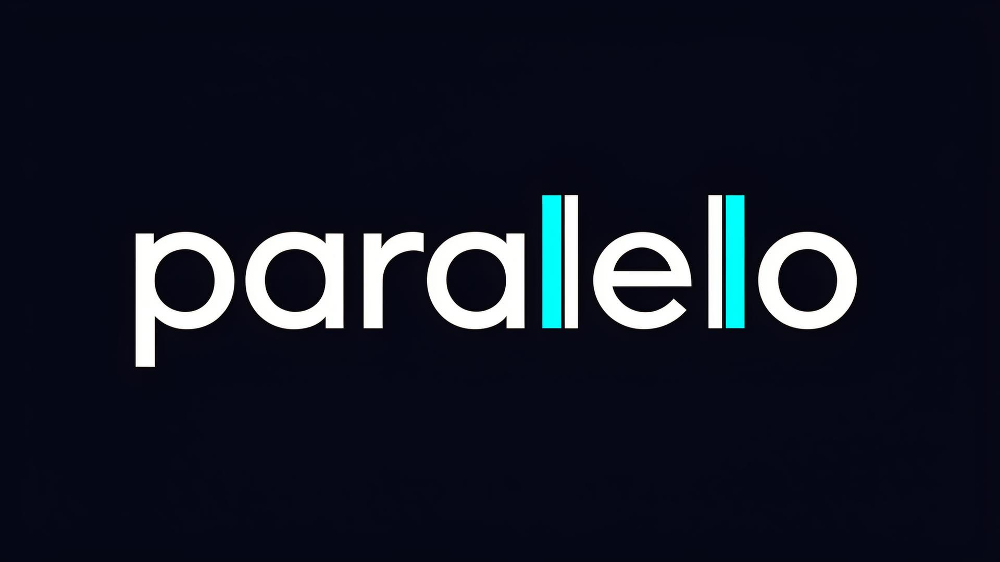

<p align="center">
  
</p>

<p align="center">
  <strong>Estudio de software · Misiones, Argentina</strong>
</p>

<p align="center">
  <a href="https://paralelo-studio.vercel.app">🌐 Ver sitio</a> •
  <a href="#tech-stack">💻 Stack</a> •
  <a href="#instalación">🚀 Instalación</a> •
  <a href="#estructura">📁 Estructura</a>
</p>

<p align="center">
  
  
  
  
  
</p>

---

## ¿Qué es Paralelo?

**Paralelo** es un estudio de software fundado en 2025 en Misiones, Argentina. Nos especializamos en construir software web a medida: sistemas, plataformas internas y productos digitales pensados para escalar con tu negocio.

Este repositorio contiene el código fuente de nuestra landing page.

---

## Tech Stack

| Categoría | Tecnologías |
|-----------|-------------|
| **Frontend** | React 19, TanStack Router, Vite |
| **Styling** | Tailwind CSS 4, tw-animate-css |
| **UI Components** | Radix UI, shadcn/ui, Lucide Icons |
| **Backend** | Supabase (Auth, Database, Storage) |
| **Animations** | USAL.js (@usal/react) |
| **Deploy** | Vercel |

---

## Instalación

```bash
# Clonar el repositorio
git clone https://github.com/HernanGonza/paralelo-software-studio.git
cd paralelo-software-studio

# Instalar dependencias
npm install

# Configurar variables de entorno
cp .env.example .env
# Editar .env con tus credenciales de Supabase

# Iniciar en desarrollo
npm run dev
```

### Variables de entorno

```env
VITE_SUPABASE_URL=tu_supabase_url
VITE_SUPABASE_ANON_KEY=tu_anon_key
```

---

## Scripts

| Comando | Descripción |
|---------|-------------|
| `npm run dev` | Inicia el servidor de desarrollo |
| `npm run build` | Build de producción |
| `npm run preview` | Preview del build |
| `npm run lint` | Ejecuta ESLint |
| `npm run format` | Formatea con Prettier |

---

## Estructura

```
src/
├── assets/              # Logos e imágenes
├── components/
│   ├── site/            # Componentes de la landing
│   │   ├── Navbar.tsx
│   │   ├── Hero.tsx
│   │   ├── About.tsx
│   │   ├── Process.tsx
│   │   ├── TechStack.tsx
│   │   ├── Projects.tsx
│   │   ├── Footer.tsx
│   │   ├── CursorTrail.tsx
│   │   ├── FloatingParticles.tsx
│   │   └── BackToTop.tsx
│   └── ui/              # Componentes de shadcn/ui
├── hooks/               # Custom hooks
├── integrations/        # Cliente de Supabase
├── lib/                 # Utilidades
├── routes/              # Rutas (TanStack Router)
│   ├── index.tsx        # Landing page
│   └── admin.tsx        # Panel de administración
├── styles.css           # Design system y animaciones
└── main.tsx             # Entry point
```

---

## Features

- ✨ **Cursor personalizado** con efecto trail
- 🎨 **Partículas flotantes** en el hero
- 📜 **Scroll infinito** de tecnologías
- 🎭 **Animaciones on-scroll** con USAL.js
- 📱 **Responsive design** optimizado para móvil
- 🔐 **Panel de admin** para gestionar proyectos
- 🗄️ **Supabase** para auth, database y storage

---

## Supabase

El proyecto usa Supabase para:

- **Auth**: Autenticación de administradores
- **Database**: Tabla `projects` para el portfolio
- **Storage**: Bucket `project-images` para imágenes

### Migraciones

```bash
# Linkear proyecto
supabase link --project-ref tu_project_ref

# Aplicar migraciones
supabase db push
```

---

## Deploy

El proyecto está configurado para deploy automático en Vercel:

1. Conectar el repo a Vercel
2. Configurar las variables de entorno
3. Deploy automático en cada push a `main`

---

## Licencia

Este proyecto es privado. © 2025 Paralelo Software Studio.

---

<p align="center">
  <sub>Hecho con 💙 en Misiones, Argentina</sub>
</p>
